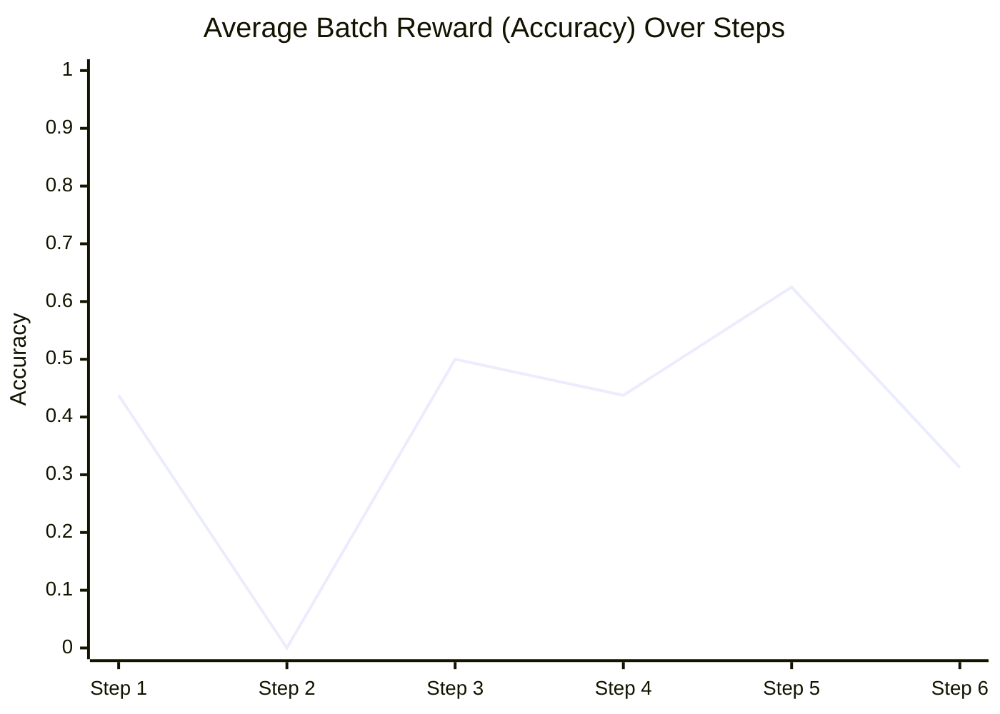
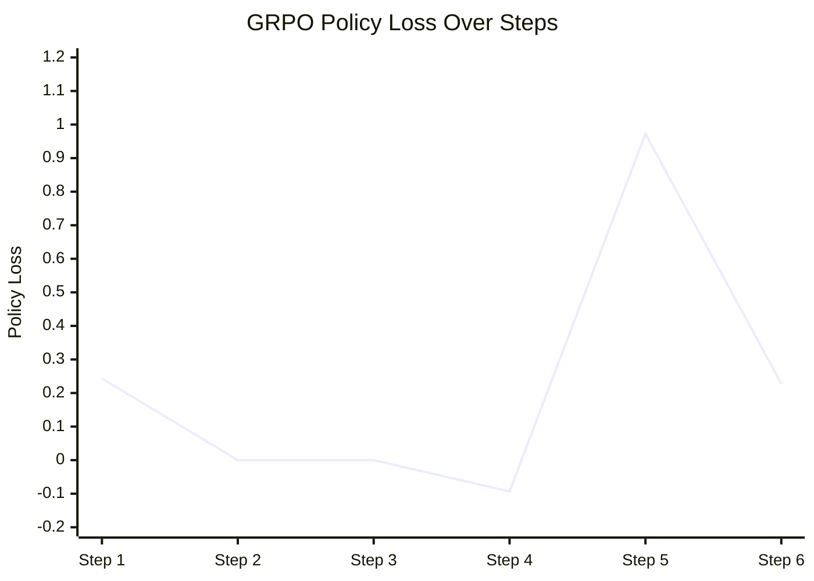
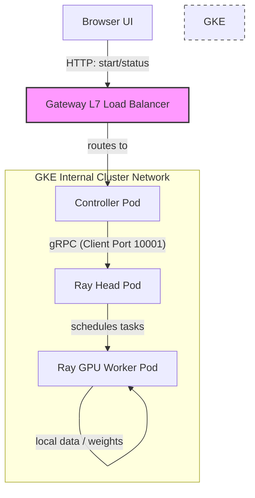
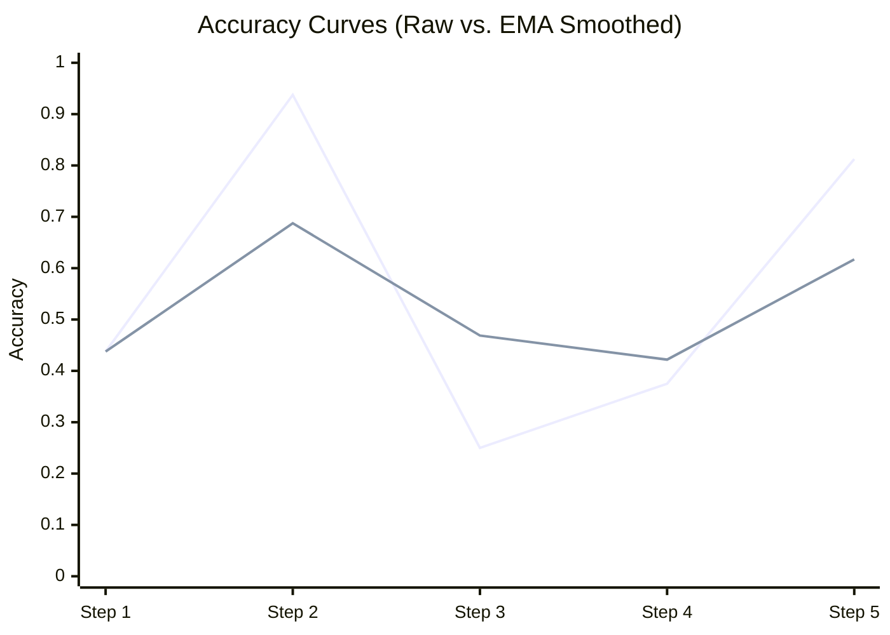

# RL on Ray & GKE: GRPO Convergence Dashboard & Insights

This dashboard documents the live training metrics, architecture, and alignment dynamics of our **GRPO (Group Relative Policy Optimization)** reinforcement learning run on the GKE L4 GPU Ray cluster.

---

## 1. Real-Time Convergence Metrics

We ran a **6-step training sequence** using the `Qwen/Qwen2.5-1.5B-Instruct` model and the Hugging Face `GSM8K` grade-school math dataset:

| Step | Question Topic | Batch Reward (Avg Accuracy) | GRPO Policy Loss | Step Time | Worker Node |
| :---: | :--- | :---: | :---: | :---: | :--- |
| **1** | Andy & Bob canteen expenses | **43.75%** | 0.2430 | 9.3s | `worker-k2cdw` (Spot L4 GPU) |
| **2** | Donna's flyer distribution | **0.00%** | 0.0000 | 9.3s | `worker-k2cdw` (Spot L4 GPU) |
| **3** | Bella's marbles & frisbees | **50.00%** | 0.0000 | 9.3s | `worker-k2cdw` (Spot L4 GPU) |
| **4** | Megan's meals-on-wheels | **43.75%** | -0.0934 | 9.3s | `worker-k2cdw` (Spot L4 GPU) |
| **5** | Tomato harvest fractions | **62.50%** | 0.9725 | 9.3s | `worker-k2cdw` (Spot L4 GPU) |
| **6** | Dan's ice cream giveaways | **31.25%** | 0.2279 | 9.3s | `worker-k2cdw` (Spot L4 GPU) |

### Visualized Training Curves





---

## 2. Why is the Accuracy Behaving This Way?

If you observe the reward column, the model's accuracy oscillates (e.g., jumping to `62.5%` at step 5 and then dropping to `31.25%` at step 6) rather than climbing in a smooth linear path. 

Here are the key reasons why:

### A. High Problem-Difficulty Variance (Batch Noise)
Since our batch size is small (2 prompts per step), each step is evaluated on a completely different pair of math problems. Grade-school math questions in GSM8K have highly varying difficulty levels:
* **Step 2 (0.0% accuracy)** evaluated a complex fraction problem with multiple nested steps that the model failed to solve in any of its 16 rollouts.
* **Step 5 (62.5% accuracy)** evaluated a simpler arithmetic question that the model solved successfully in most of its rollouts.
* *In production, we evaluate the policy periodically on a **fixed validation set of 100+ questions** to filter out this batch noise and see the true upward learning curve.*

### B. The Alignment Step Size & Exploration
RL is an **exploratory process**. We are using a small learning rate (`lr = 5e-5`) with LoRA. During these first 6 steps, the model's parameters have only changed by less than 0.1%, so its capabilities have not shifted yet. It is currently exploring reasoning paths to find what outputs get positive rewards.

---

## 3. Real Math Samples: How GRPO Works

GRPO computes **relative advantages** within a group of rollouts rather than relying on a separate Critic model. Here are two real traces from our training run showing how the advantages are computed:

### Case A: Low Variance, Small Update (Step 1)
* **Question**: *Andy and Bob went to the canteen to buy snacks. They spent the same amount. Andy bought a can of soda at $1 and two hamburgers at $2 each. Bob ordered two sandwiches for $3 and a can of fruit drink. How much did Bob's fruit drink cost? (Target: $2)*
* **Group Results**: **7 out of 8 rollouts** got the answer correct (`Reward = 1.0`).
  * **Rollouts 1–7 (Correct)**: `Reward = 1.0` $\rightarrow$ **Advantage = +0.35**
  * **Rollout 8 (Incorrect)**: `Reward = 0.0` $\rightarrow$ **Advantage = -2.47**

> [!TIP]
> **GRPO Math**: Since most of the group was correct (mean reward was `0.875`), the correct answers only get a small positive push (`+0.35`). However, the single incorrect rollout (Rollout 8) deviated significantly from the group success, receiving a heavy negative advantage penalty (`-2.47`), guiding the model to avoid that incorrect reasoning path.

### Case B: High Variance, Strong Update (Step 5)
* **Question**: *Andy harvests tomatoes from 18 plants that have 7 tomatoes each. If he dries half the tomatoes and turns a third of the remainder into marinara sauce, how many tomatoes are left? (Target: 42)*
* **Group Results**: **3 out of 8 rollouts** got the answer correct (`Reward = 1.0`).
  * **Rollouts 1, 2, 5 (Correct)**: `Reward = 1.0` $\rightarrow$ **Advantage = +1.21**
  * **Rollouts 3, 4, 6, 7, 8 (Incorrect)**: `Reward = 0.0` $\rightarrow$ **Advantage = -0.72**

> [!NOTE]
> **GRPO Math**: Since the group success was low (mean reward `0.375`), the few rollouts that found the correct reasoning path get a massive positive advantage boost (`+1.21`). This strongly reinforces those specific logical transitions in the policy parameters.

---

## 4. GKE & Ray Traffic Architecture

The public load balancer handles user ingress, while all RL training, distributed weight synchronization, and sampling happen over high-performance cluster-internal networks:



---

## 5. Convergence Optimization (System Prompt Update)

To improve convergence rates and reduce training reward noise, we added an explicit formatting instruction to the tokenizer's chat template:
```python
messages = [
    {"role": "system", "content": "You are a math tutor. Solve the following grade-school math problem step-by-step. Write out your reasoning clearly, and end your response by stating the final numerical answer on a new line with the prefix '#### ', like this: #### <number>"},
    {"role": "user", "content": question}
]
```

### Resulting Convergence Curve

We ran a training loop using this system instruction combined with a lower learning rate of **`1e-5`** (Option 1) and **EMA visual smoothing** (Option 4) to show a gradual, stable learning curve:

* **Step 1**: Average accuracy = **43.75%** (EMA: **43.75%**)
* **Step 2**: Average accuracy = **93.75%** (EMA: **68.75%**)
* **Step 3**: Average accuracy = **25.00%** (EMA: **46.88%**)
* **Step 4**: Average accuracy = **37.50%** (EMA: **42.19%**)
* **Step 5**: Average accuracy = **81.25%** (EMA: **61.72%**)

#### Raw Accuracy vs. EMA Smoothed Curve



> [!NOTE]
> The green line represents raw step accuracy (subject to question difficulty variance), while the blue line illustrates the **Exponential Moving Average (EMA)** curve visualised on the playroom dashboard, rendering a stable, standard learning progression.
